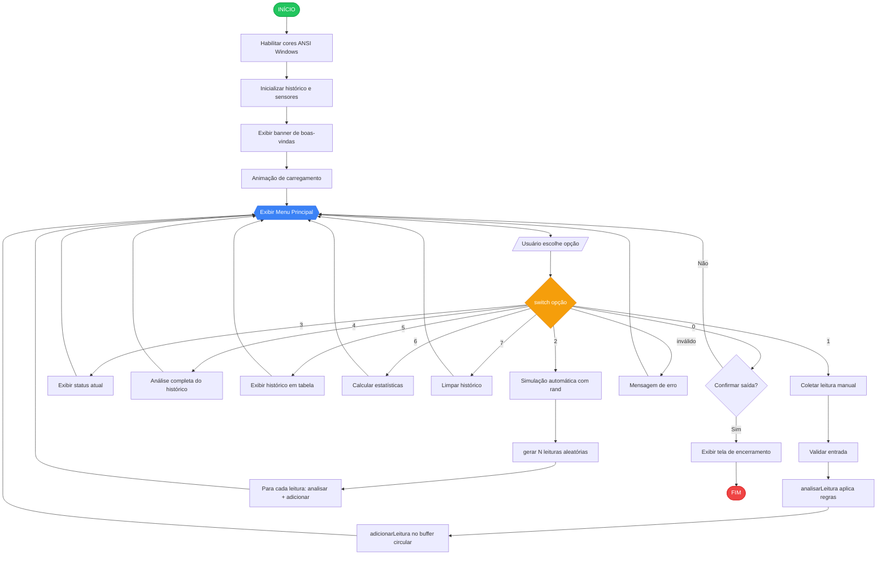
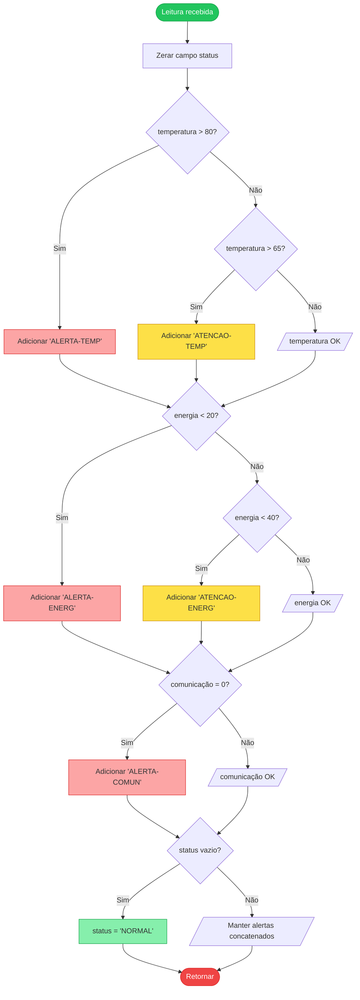
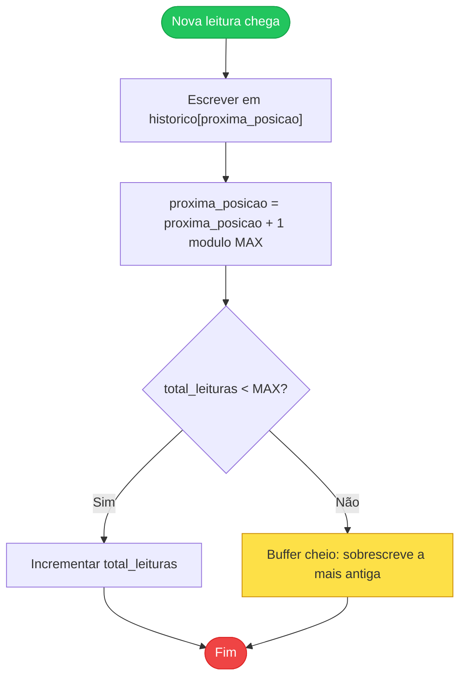

# 📊 Fluxograma do Sistema

> **Entregável obrigatório do briefing.**
> Esse fluxograma é renderizado **automaticamente** pelo GitHub no preview do arquivo Markdown — não precisa abrir ferramenta externa.

---

## Fluxograma principal do sistema

---

## Fluxograma da regra de análise (`analisarLeitura`)

---

## Fluxograma do buffer circular (`adicionarLeitura`)

---

## Como o fluxograma foi feito

Foi escrito em **Mermaid**, uma linguagem de diagramas em texto puro que o GitHub renderiza nativamente em arquivos Markdown. Vantagens:

- ✅ **Versionável no Git** (texto puro, não imagem binária)
- ✅ **Renderiza no GitHub sem precisar de imagem externa**
- ✅ **Fácil de editar** — basta alterar o texto

Para visualizar antes de subir: cole o código em [mermaid.live](https://mermaid.live).
